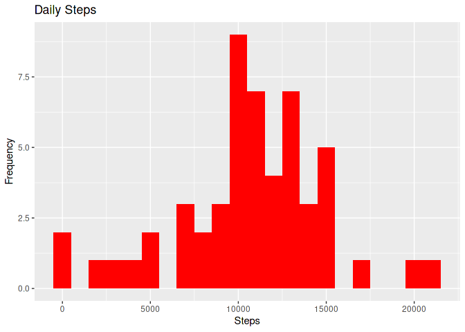
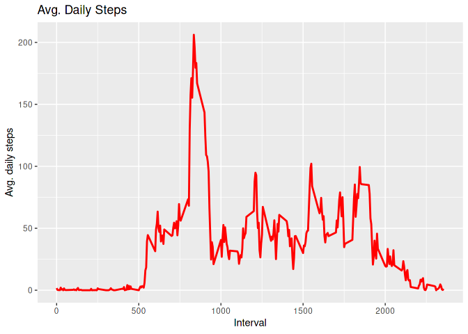
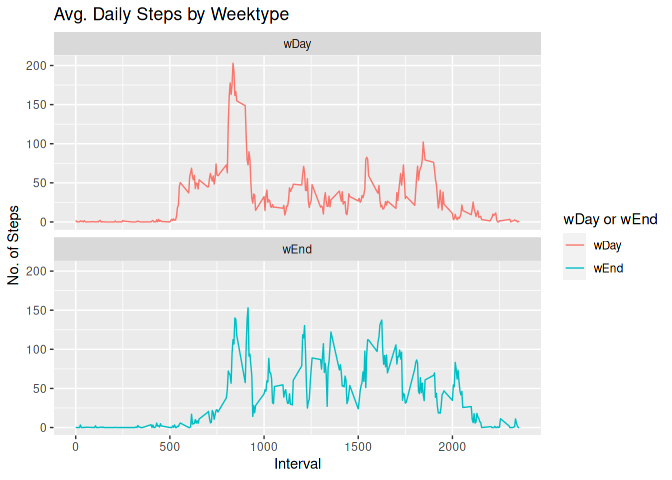

##Done by Vidish   
## Loading and preprocessing the data   


```r
library("data.table")
library(ggplot2)
dataset = "https://d396qusza40orc.cloudfront.net/repdata%2Fdata%2Factivity.zip"
download.file(dataset, destfile = paste0(getwd(), '/repdata%2Fdata%2Factivity.zip'), method = "curl")
unzip("repdata%2Fdata%2Factivity.zip",exdir = "data")
```


```r
activTable <- data.table::fread(input = "data/activity.csv")
```


## What is mean total number of steps taken per day?

maxSteps stores the total number of steps.


```r
maxSteps <- activTable[, c(lapply(.SD, sum, na.rm = FALSE)), .SDcols = c("steps"), by = .(date)] 
head(maxSteps, 10)
```

```
##           date steps
##  1: 2012-10-01    NA
##  2: 2012-10-02   126
##  3: 2012-10-03 11352
##  4: 2012-10-04 12116
##  5: 2012-10-05 13294
##  6: 2012-10-06 15420
##  7: 2012-10-07 11015
##  8: 2012-10-08    NA
##  9: 2012-10-09 12811
## 10: 2012-10-10  9900
```

Next we need to make a histogram 


```r
ggplot(maxSteps, aes(x = steps)) +
    geom_histogram(fill = "red", binwidth = 1000) +
    labs(title = "Daily Steps", x = "Steps", y = "Frequency")
```

```
## Warning: Removed 8 rows containing non-finite values (stat_bin).
```

<!-- -->

Next, we need to calculate the mean steps and the median steps on a daily basis.


```r
maxSteps[, .(Steps_mean = mean(steps, na.rm = TRUE), Steps_median = median(steps, na.rm = TRUE))]
```

```
##    Steps_mean Steps_median
## 1:   10766.19        10765
```

## What is the average daily activity pattern?


First we make a time series graph for the 5-min periods (x-axis) and the avg number of steps ~ avg per day (y-axis)


```r
time5Table<- activTable[, c(lapply(.SD, mean, na.rm = TRUE)), .SDcols = c("steps"), by = .(interval)] 
ggplot(time5Table, aes(x = interval , y = steps)) + geom_line(color="red", size=1) + labs(title = "Avg. Daily Steps", x = "Interval", y = "Avg. daily steps")
```

<!-- -->

2. Which 5-minute period has the max number of steps?


```r
time5Table[steps == max(steps), .(max_interval = interval)]
```

```
##    max_interval
## 1:          835
```

## Imputing missing values

1. Calculate total number of NA rows


```r
activTable[is.na(steps), .N ]
```

```
## [1] 2304
```

2.Use the median for that day to fill missing values.


```r
activTable[is.na(steps), "steps"] <- activTable[, c(lapply(.SD, median, na.rm = TRUE)), .SDcols = c("steps")]
```

3. Create a new dataset with the missing data added.


```r
data.table::fwrite(x = activTable, file = "data/fixedData.csv", quote = FALSE)
```


## Are there differences in activity patterns between weekdays and weekends?

1. Create a new variable with two levels – “wDay” and “wEnd” for weekday or weekend.


```r
activTable[, date := as.POSIXct(date, format = "%Y-%m-%d")]
activTable[, `Day of Week`:= weekdays(x = date)]
activTable[grepl(pattern = "Monday|Tuesday|Wednesday|Thursday|Friday", x = `Day of Week`), "wDay or wEnd"] <- "wDay"
activTable[grepl(pattern = "Saturday|Sunday", x = `Day of Week`), "wDay or wEnd"] <- "wEnd"
activTable[, `wDay or wEnd` := as.factor(`wDay or wEnd`)]
head(activTable, 10)
```

```
##     steps       date interval Day of Week wDay or wEnd
##  1:     0 2012-10-01        0      Monday         wDay
##  2:     0 2012-10-01        5      Monday         wDay
##  3:     0 2012-10-01       10      Monday         wDay
##  4:     0 2012-10-01       15      Monday         wDay
##  5:     0 2012-10-01       20      Monday         wDay
##  6:     0 2012-10-01       25      Monday         wDay
##  7:     0 2012-10-01       30      Monday         wDay
##  8:     0 2012-10-01       35      Monday         wDay
##  9:     0 2012-10-01       40      Monday         wDay
## 10:     0 2012-10-01       45      Monday         wDay
```

2.Plot of the 5-minute period (x-axis) and the avg number of steps take ~ avg across all weekday days or weekend (y-axis).


```r
activTable[is.na(steps), "steps"] <- activTable[, c(lapply(.SD, median, na.rm = TRUE)), .SDcols = c("steps")]
time5Table <- activTable[, c(lapply(.SD, mean, na.rm = TRUE)), .SDcols = c("steps"), by = .(interval, `wDay or wEnd`)] 
ggplot(time5Table , aes(x = interval , y = steps, color=`wDay or wEnd`)) + geom_line() + labs(title = "Avg. Daily Steps by Weektype", x = "Interval", y = "No. of Steps") + facet_wrap(~`wDay or wEnd` , ncol = 1, nrow=2)
```

<!-- -->
